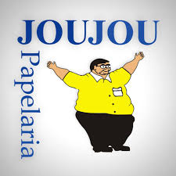
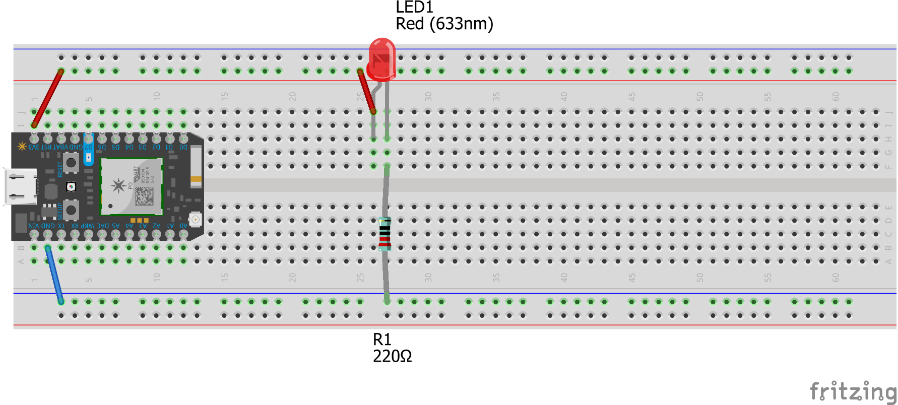
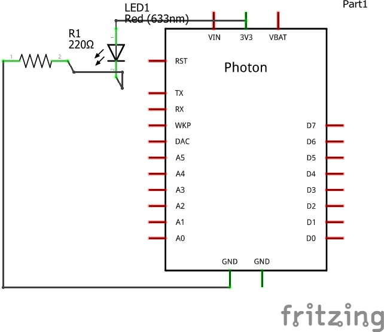
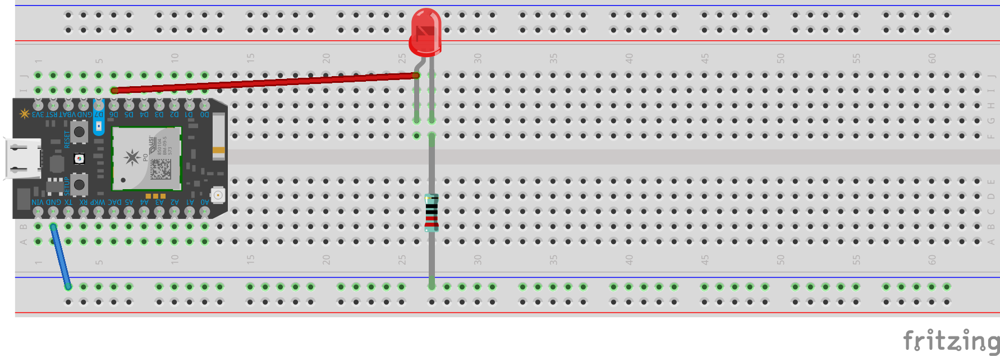
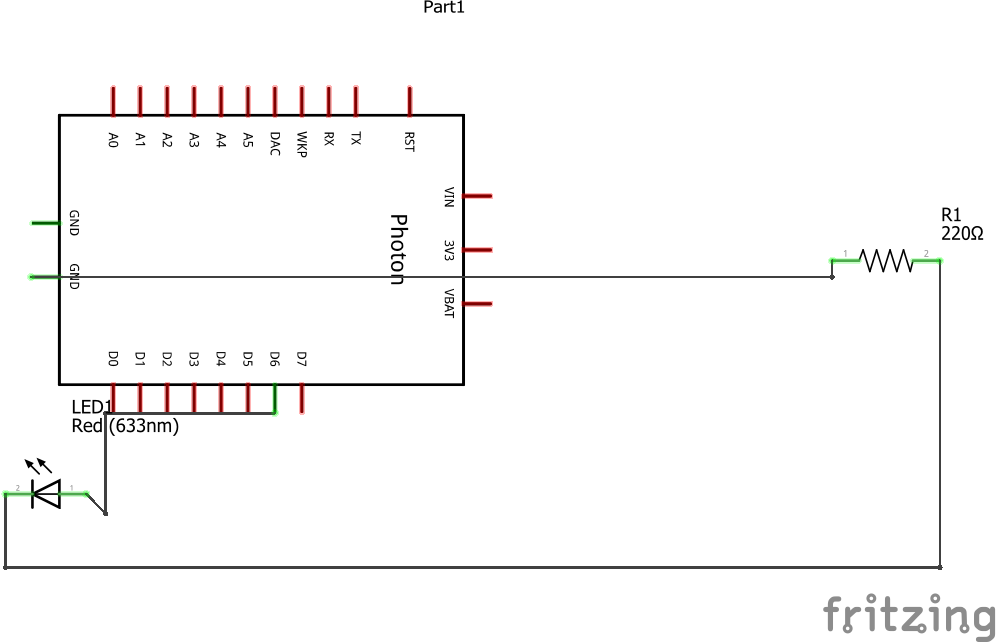
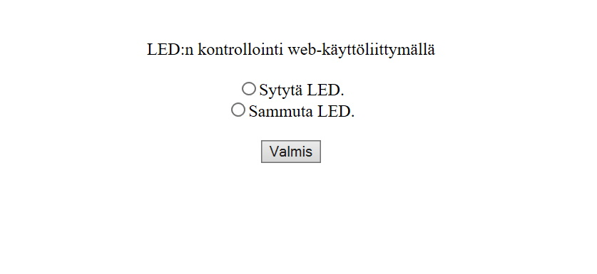

# Sääasema 2020  
## Vaatimusmäärittely  
 **Sovelluksen tarkoitus**  
 * Mitataan ympäristön lämpötila- ilmankosteustietoja.  
 * Saatuja tietoja voidaan tarkistella tekstinä ja grafiikkana web sovelluksella.  
 
 **Käyttäjät**  
 
 Web sovellus on tarkoitettu julkiseen käyttöön.  
 
 **Käyttöliittymä**  
 
 Käyttöliittymä koostuu kahdesta näkymästä:  
  1. Tekstimuotoisen datan selaamiseen tarkoitettu näkymä  
  1. Grafiikkamuotoisen datan selaamiseen tarkoitettu näkymä  
  
  **Jatkokehitysideoita**  
  
  Säätietojen selaaminen valitulla aikavälillä.  
 
 ## Arkkitehtuurikuvaus  
 
 **Luokkakaavio**  
 
 
 
 **Sekvenssikaavio**  

 
 

 **Työvaiheet**  
 päivä | aika | vaihe
--------------|-----------------|-----------------------  
30.10 | 20min | Ledin kytkentä  
4.11 | 30min |  Ledin vilkuttaminen  
4.11 | 30min | Ledin kontrollointi selainpohjaisella järjestelmällä  
4.11 | 30min | Valoisuuden mittaaminen fototransistorilla  

## vaihe 1  

  


  

## vaihe 2  

  
````
int led = D6;  

void setup() {

  pinMode(led, OUTPUT);

}

void loop() {

  digitalWrite(led, HIGH);

  delay(1000);

  digitalWrite(led, LOW);

  delay(1000);

}
````  



## vaihe 3  



## vaihe 4  
````
{"cmd":"VarReturn","name":"analogvalue","result":10,"coreInfo":{"last_heard":"2020-11-18T08:17:33.585Z","connected":true,"last_handshake_at":"2020-11-18T08:17:33.585Z","deviceID":"2f0035001947393035313138","product_id":6}}
````
## Käyttöohje  
**Järjestelmän konfigurointi**  

Lataa node_modules  
````  
npm install  
````  
Käynnistä projekti paikallisesti porttiin 3000  
````  
npm start  
````


# Alan toimintaympäristöt ja ilmiöt  
Tekstiä voi kirjoittaa vaikka **lihavoituna**, *kursivoituna* tai ~~yliviivattuna~~.  

Erilaisia otsikoita voi tehdä laittamalla # merkkejä peräkkäin:  
# 1. tason otsikko  
## 2. tason otsikko  
### 3. tason otsikko  
#### 4. tason otsikko  
##### 5. tason otsikko  
###### 6. tason otsikko  

Listoja voit tehdä näin:  
* Listan ensimmäinen elementti
* Listan toinen elementti
* Listan kolmas elementti
  * Kolmannen elementin ensimmäinen alielementti  
  * Kolmannen elementin toinen alielementti

Numeroitu lista:  
1. Eka juttu  
1. Toka juttu  
1. Kolmas juttu  
   1. Kolmannen eka juttu  
   1. Kolmannen toinen juttu  
   
Readme.md -tiedostoon voi laittaa myös kuvia.


Linkitkin toimii:
http://www.google.com (automaattisesti)  
[Google](http://google.com)  

Näinkin voi tehdä  
> Kirjoitetaan tähän tekstiä  
> Tähän lisää tekstiä  

Tässä tapauksessa teksti tulee laatikkoon:  
````  
function kirjoitaTeksti(kirjoita)  
 if(kirjoita) {  
  console.log("parametri oli tosi")
  }
````  
Taulukon sarakkeen otsikko | Seuraavan sarakkeen otsikko  
---------------------|----------------------
ABC | 123  
XYZ | 456  

:sunglasses:
